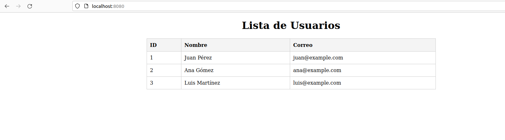

# Práctica 3 Servicios web

- Máquina:Escritorio Pr. Combinada Serv. Ap.
	- Instalado php
	- Instalado nginx
	- Instalado node
	- Instalado mysql
	- PENDIENTE php y complementos
	- Opcional phpmyadmin

- Despliegue 1:
	- Apache puerto 
	- http://localhost:8080
	- Aplicación demo de otros días.

    Editamos el archivo .conf:

    

    Creacion de base de datos:

    usando sudo mysql se crea la base demo `CREATE DATABASE demo;`
    y el usuario `CREATE USER 'demo'@'%' IDENTIFIED BY 'contraseña';`
    le damos permiso al usuario `GRANT ALL PRIVILEGES ON demo.* TO 'demo'@'localhost';`
`

    Hay que asegurarse de que las credenciales de la aplicacion en /app/index.php coinciden con el usuario y la base que hemos creado en la base de datos:

    

    Ahora sera necesario reiniciar el servicio con systemctl reload apache2, despues de esto ya podremos acceder mediante localhost:8080

    

	
- Despliegue 2
	- Node puerto 3000
	- http://localhost:3000
	- Aplicación demo de otros días

    En la base de datos creada anteriormente hacemos la tabla deseos.

    tras clonar el repositorio github sera necesario darle permisos para que npm funcione, dentro de la carpeta se ejecuta el comando npm install para instalar las dependencias npm.

    Para que conecte con la base de datos debemos modificar el archivo /models/db.js:

    

    Ahora podremos hacer que funcione con el comando npm start, que lo iniciara en el puerto 3000:

    

    
- Configuración proxy inverso
	- Sitio1: http://php.local	
	- Sitio1: http://node.local
	- Puerto 80
	- Recuerda que debes configurar el fichero hosts

    Configuracion del proxy: Una vez configurado se crea un enlace blando que apunte a sites/enabled

    

    Fichero /etc/hosts:

    

    Esto hara que podamos acceder sin necesidad de escribir localhost:puerto

    

    

