# Practica Ubuntu Server

## Cambiar nombre del servidor
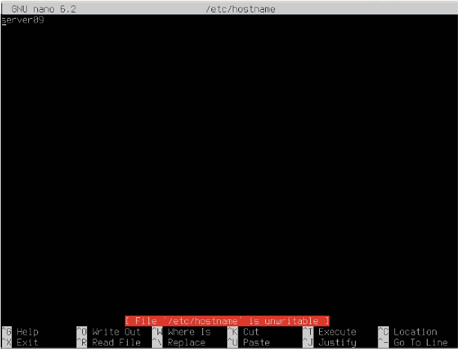

## Configuración de tarjeta de red asignando una IP para el servidor.
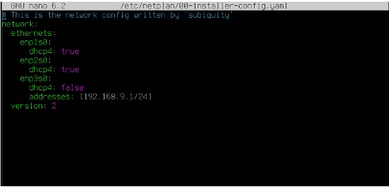

## Ubuntu cliente

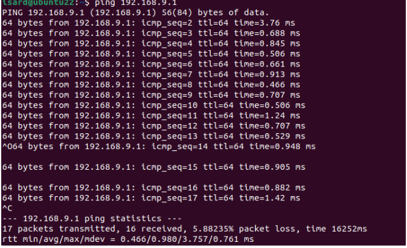

# Windows Cliente

## Cambiamos el nombre del equipo
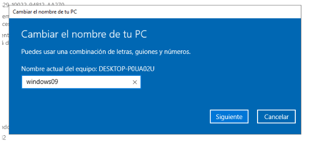

## Asignamos una IP que pueda comunicarse con el servidor
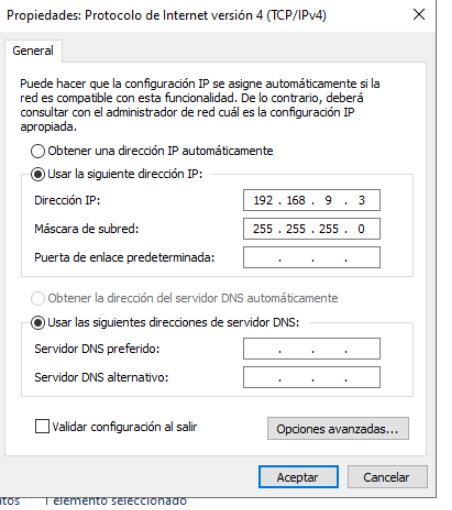

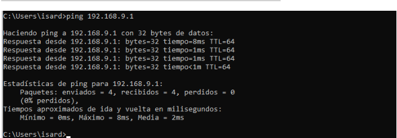

# DHCP

## Añadimos la IP que actuará de DHCP
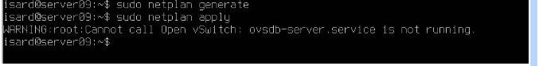

## Instalamos el servidor con **apt-get install isc-dhcp-server**

## Editamos el fichero **/etc/default/isc-dhcp-server**
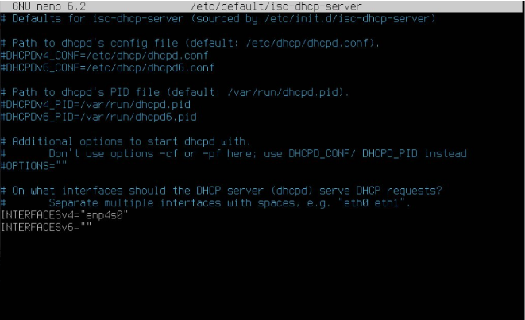

## El fichero principal de configuración de DHCP es **/etc/dhcp/dhcpd.conf.** 
## Modificamos este archivo definiendo la subnet y el rango de IPs que se van a repartir a los clientes
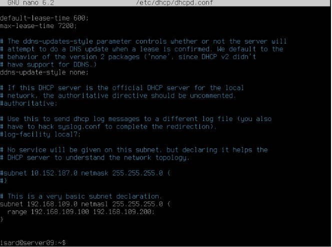

## Reiniciamos el servicio
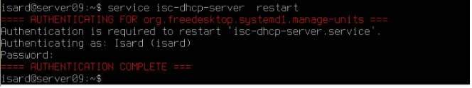

## Comprobamos que se asigna la IP en Windows y Ubuntu
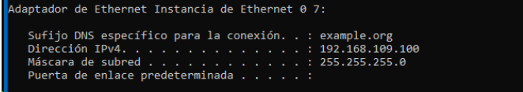
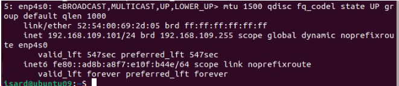

## Comprobamos el estado del servidor
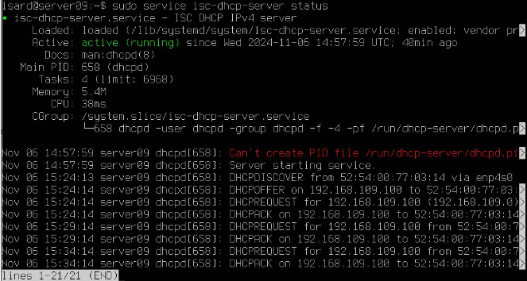

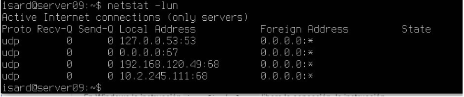

## Verificamos los leases en el servidor
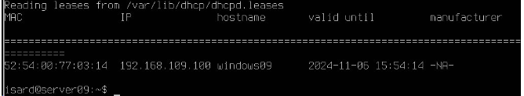

## Configuramos una reserva definiendo la MAC del cliente al que queremos que se le conceda y la IP que le queremos dar, y reiniciamos el server
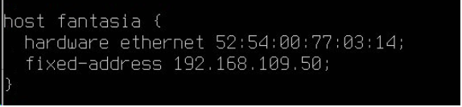

## Hacemos un ip renew y comprobamos que le ha dado la ip reservada
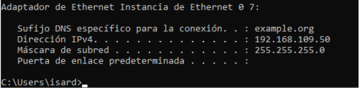

## Al apagar el servidor podemos comprobar que la configuración no cambia.

