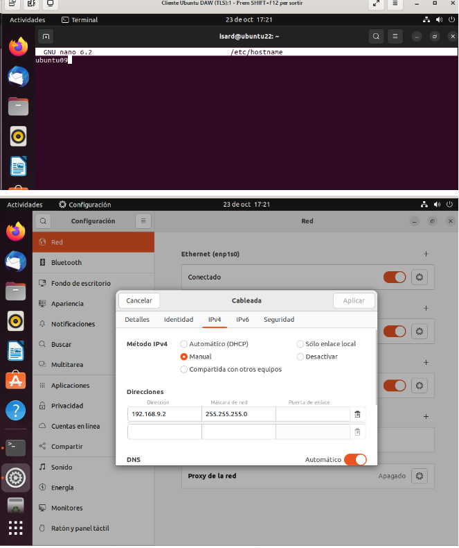

# Practica Ubuntu Server

Cambiamos el nombre del servidor


Configuramos la tarjeta de red accediendo a ```/etc/netplan/00-installer-config.yaml```


# Ubuntu cliente

Cambiamos el nombre del equipo en ```/etc/hostname``` y le asignamos una IP que pueda comunicarse con el servidor



Comprobamos que hace ping al servidor


# Windows Cliente

 Cambiamos el nombre del equipo


 Asignamos una IP que pueda comunicarse con el servidor


Comprobamos que tambien hace ping al servidor


# DHCP

Añadimos la IP que actuará de DHCP


Instalamos el servidor con ```apt-get install isc-dhcp-server```

Editamos el fichero ```/etc/default/isc-dhcp-server```


El fichero principal de configuración de DHCP es ```/etc/dhcp/dhcpd.conf.```
 Modificamos este archivo definiendo la subnet y el rango de IPs que se van a repartir a los clientes


Reiniciamos el servicio


Comprobamos que se asigna la IP en Windows y Ubuntu


Comprobamos el estado del servidor


Verificamos los leases en el servidor


Configuramos una reserva definiendo la MAC del cliente al que queremos que se le conceda y la IP que le queremos dar, y reiniciamos el server


Hacemos un ip renew y comprobamos que le ha dado la ip reservada


## Al apagar el servidor podremos comprobar que la configuración no cambia.


